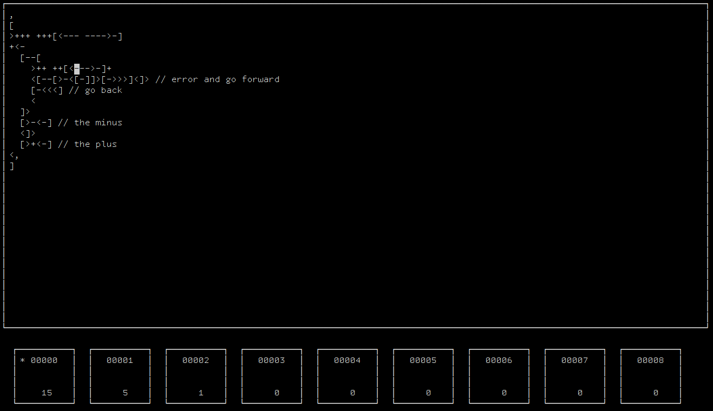

# Bf debugger for your terminal



(Easily?) follow your unreadable bf code.

## Compilation

### 1) Clone this repo.
```sh
git clone https://github.com/andrewandreii/bf_ncurses_debugger.git
cd bf_ncurses_debugger
```

### 2) Install the ncurses library.

If you're using pacman, do:
```sh
pacman -S ncurses
```

### 3) Run make.
```sh
make
```

## Quick start

```sh
./debugger file_to_debug.bf
```